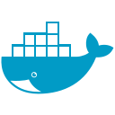
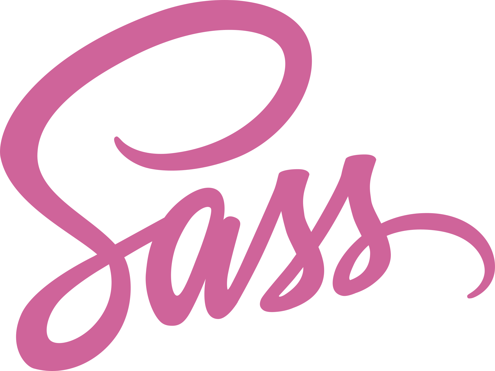

<pre align="center">
  <h1>SERGIO GEOVANY PORTILLA CASTAÑEDA</h1>
Full-stack Developer 
</pre>

  
  

<h2 align="center">
  
  About me 
  
</h2>

  <b>System engineer</b> with deep fundamentals in web development and
  mobile applications, through different tools and frameworks, giving
  interactive architectures with easy and save access to database.
  Deep expertise designing applications to improve user’s experience,
  knowledge on applications and methodologies to mock-ups' creations
  and design’s guidelines, as well as keeping a good standard responsive
  and skills in code review and issue's depurations.

- 🔭 I’m currently working on ADDI 🎉
- 🌱 I’m currently learning **Dart, SolidJs and Vert.x**
- 💪 My skills are more related to the Front-end side and design

<h2 align="center"> 🔥 Languages & frameworks 🔥 </h2>
 

  <code></code>
  <code></code>
  <code></code>
  <code></code>
  <code></code>
  <code></code>
  <code></code>
  <code></code>
  <code></code>
  <code></code>
  <code></code>
  <code></code>

<h2 align="center"> 🛠️ Job background 🛠️ </h2>

> 💡 In the overview below you will see all my background projects

  
<h3 style="margin: 0; display: inline-block">⏱️ Fulltime projects</h3>

  <ul style="list-style: none">
    <li>
      
      

        <a href="https://www.linkedin.com/company/id-systems-sa/">ADDI</a>  
        <b>Development architect</b>  
        <b>Full-time</b> • 2 years   
        Technologies: 
          <code>React</code>, <code>Github actions</code>, 
          <code>Java</code>, <code>Redux</code>, <code>Vertx</code>
      

    </li>
    <li>
      
      

        <a href="https://www.ceiba.com.co/">Ceiba Software</a> (Scotiabank Colpatria outsourcing)  
        <b>Development architect</b>  
        <b>Full-time</b> • 2 years   
        Technologies: 
          <code>Angular</code>, <code>Node JS</code>, 
          <code>Java</code>, <code>Docker</code>, <code>Jenkins</code>,
          <code>SonarQube</code>, <code>Black-duck</code>, <code>Fortify</code>
      

    </li>
    <li>
      
      

        <a href="https://www.linkedin.com/company/id-systems-sa/">ID systems sa</a> (National registry of Colombia outsourcing)  
        <b>Development architect</b>  
        <b>Full-time</b> • 2 years   
        Technologies: 
          <code>Angular</code>, <code>java</code> 
          <code>JSP</code> <code>spring-boot</code>, <code>JSF</code>
      

    </li>
  </ul>

  
<h3 style="margin: 0; display: inline-block">️📌 Freelance projects</h3>

  
<h3 style="margin: 0; display: inline-block">️🎨 Own projects</h3>

<h2 align="center">⚡ Stats ⚡  </h2>

  
  
  
  

<h2 align="center">📎 Get in touch 📎</h2>
 

